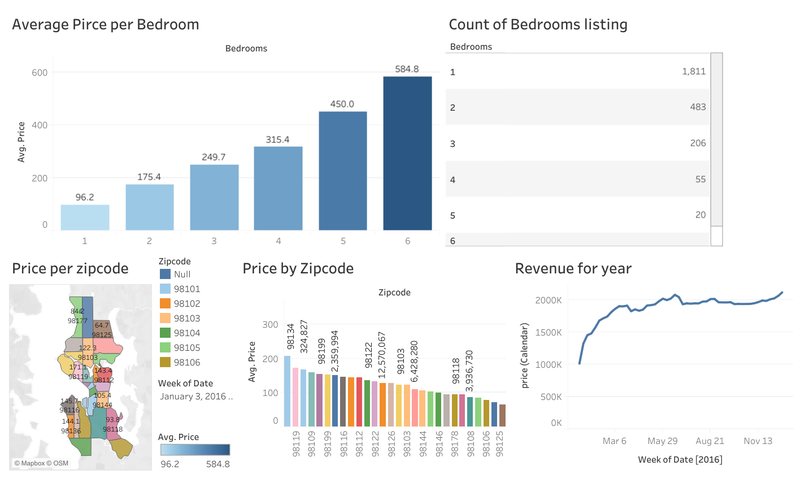

# 🏡 Airbnb Dashboard

Interactive **Tableau** dashboard exploring Airbnb listings data to uncover
pricing patterns, neighborhood trends, and yearly revenue insights.

## ✨ Overview
This project visualizes key Airbnb metrics to help hosts, travelers,
and analysts understand market dynamics.  
The dashboard includes:
- **Average Price per Bedroom** – Compare how listing prices scale with number of bedrooms.
- **Price by Zipcode** – Identify neighborhoods with higher or lower average prices.
- **Revenue Over Time** – Track total revenue growth throughout the year.

## 📊 Features
- Dynamic bar charts, line charts, and geospatial maps.
- Interactive filters for bedrooms, zip codes, and dates.
- Clean, mobile-friendly layout.

## 🔗 Live Dashboard
👉 [View on Tableau Public](https://public.tableau.com/shared/RNFBFMPR3?:display_count=n&:origin=viz_share_link)

## 🛠️ Tech Stack
- **Tableau** for data visualization
👉[data set link](https://www.kaggle.com/datasets/alexanderfreberg/airbnb-listings-2016-dataset/data?select=Tableau+Full+Project.xlsx).

